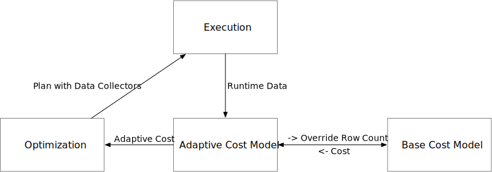
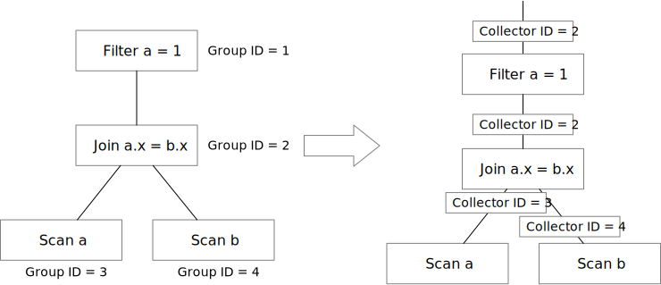

# Re-optimization

optd implements re-optimization inspired by [How I Learned to Stop Worrying and Love Re-optimization](https://arxiv.org/abs/1902.08291). optd generates a plan, injects executors to collect runtime data, and uses the runtime information from the previous run to guide the optimization process.

optd persists optimizer states from run to run. The states include: the memo table, whether a rule is applied on an expression, explored groups, etc. By persisting the states, optd can easily match a query plan or a subset of the query plan with plans that have been executed. Once these plan matches are discovered, the adaptive cost model can use the runtime data in the cost computation process to make the cost model more robust and accurate.

## Cost Model

In the optd Datafusion representation, we have 2 cost models: the base cost model and the adaptive cost model. The base cost model estimates the compute and I/O cost solely based on number of rows. The adaptive cost model maintains a hash map that maps plan node group ID to runtime information from the previous N runs, and uses these runtime information to compute a more accurate row count. The adaptive cost model will use the accurate row count information to call into the base cost model that computes a more accurate compute and I/O cost.

  
## Execution

optd will inject collector executors into the query plan. We extended Datafusion to have a new executor called physical collector. The executor will count the number of rows passed from the child executor to the parent executor, and then store the information into the runtime data storage.

## Optimization Phases

To enable re-optimization, the user should not clear the internal state of the optimizer. This can be achieved by calling `step_clear_winner` and then `step_optimize_rel`.
